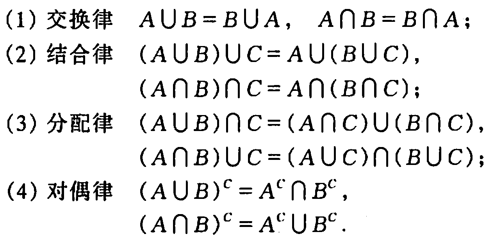
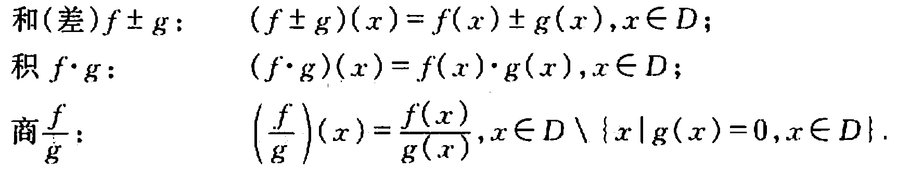
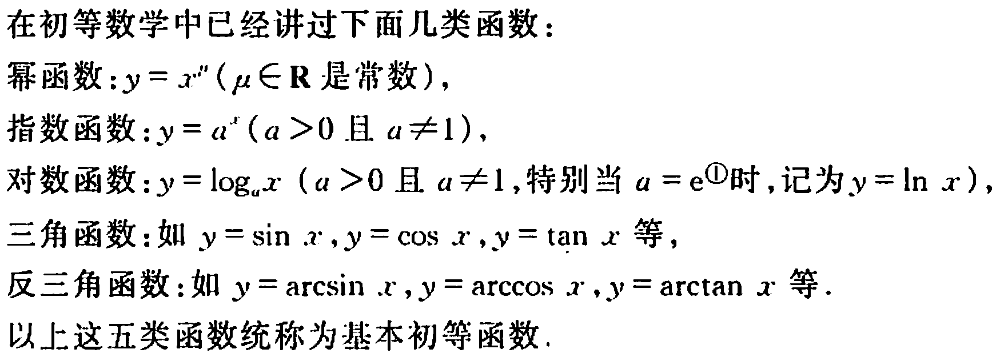
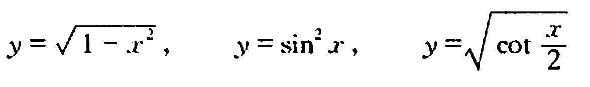
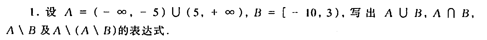
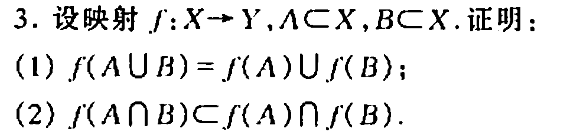
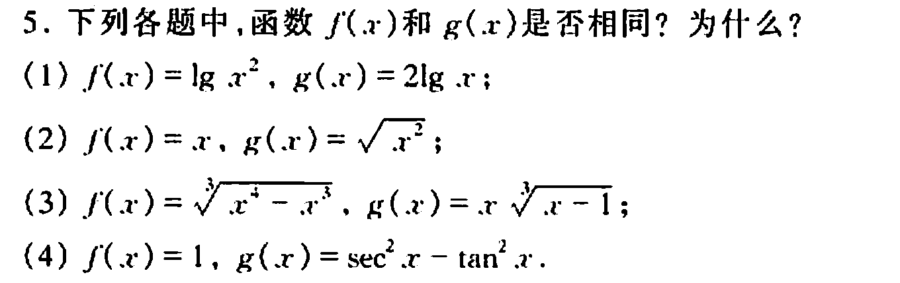
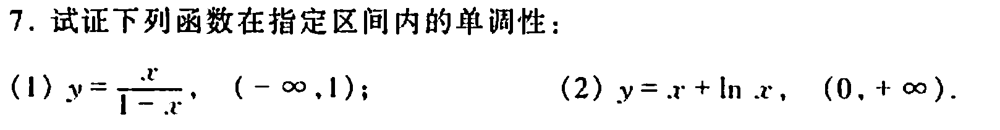
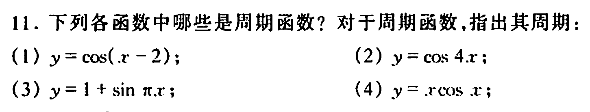

# 高等数学复习

[TOC]

## 第一章 函数与极限

### 第一节 映射与函数

#### 一 、集合

- 定义： 是指具有某种特定性质的事务的总体 ， 组成这个集合的事务称为这个集合的元素

- 例如： A = { a1 ,a2 ,a3 ......}

- 集合的运算 ， 交运算，并运算，差集运算（ A\B = {x| x ∈ A  & x not ∈ B}）

  几种集合的运算规律：

  

1. 区间和邻域

   - 开区间 ， 闭区间

2. 映射 s

   - 定义：两个非空集合之间的对应关系 
   
   - 注意：映射必须是对应的，譬如一个x只能对应一个y，但是值相同的y可以对应两个x
   
   - 逆映射：只有单射才存在逆映射（单射：x与y一一对应，不存在一个y对应两个x的情况）
   
   - 复合映射：相当于 y = *f* (x) , z = *g* (y)  , 也就是说，x 为定义域， y为映射f()的值域，同时 y又满足为g()的定义域
   
3. 函数

   - 定义： 设数集D ⊂ R， 则称映射 *f* ：D  → R为定义在D上的函数 ，通常记为

     y  = *f* (D) , x ∈ D 

   - 分段函数：函数的定义域不连续

   - 函数的几种性质：

     - 有界性
     - 单调性
     - 奇偶性
     - 周期性

   - 不是所有函数都满足以上性质，只有少数满足 ， 但是都满足有界性

   - 反函数和复合函数

     - 一个函数的逆映射，即反函数
     - 复合映射

   - 函数的运算：和、积、商

     

   - 初等函数：

     

     由常数和基本初等函数经过有限次的四则运算和有限次的函数复合步骤所构成并可用一个式子表示的函数，称为初等函数，例如：

     

4. 习题：今天之前要至少完成五篇习题

   1. 习题1

      
   
   2. 习题2
   
      
   
   3.  习题3 
   
      
   
   4.  习题4
   
      
   
   5.  习题5
   
      
   
   
   
   

